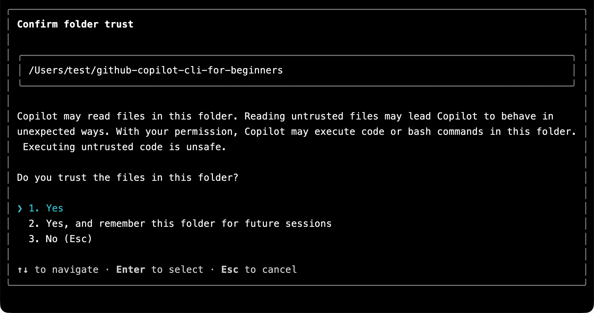

# Quick Start — Copilot CLI Training

Welcome! In this chapter, you'll get GitHub Copilot CLI (Command Line Interface) installed, signed in with your GitHub account, and verified that everything works. This is a quick setup chapter. Once you're up and running, the real demos start in Chapter 01!

## Learning Objectives

By the end of this chapter, you'll have:

- Installed GitHub Copilot CLI
- Signed in with your GitHub account
- Verified it works with a simple test

## Prerequisites

- GitHub Account with Copilot access. See subscription options. Students/Teachers can access Copilot Pro for free via GitHub Education.
- Terminal basics: Comfortable with commands like `cd` and `ls`

### What "Copilot Access" Means

GitHub Copilot CLI requires an active Copilot subscription. You can check your status at [github.com/settings/copilot](https://github.com/settings/copilot). You should see one of:

- Copilot Individual - Personal subscription
- Copilot Business - Through your organization
- Copilot Enterprise - Through your enterprise
- GitHub Education - Free for verified students/teachers

If you see "You don't have access to GitHub Copilot," you'll need to use the free option, subscribe to a plan, or join an organization that provides access.

## Installation

### GitHub Codespaces (Zero Setup)

If you don't want to install any of the prerequisites you can use GitHub Codespaces, which has the GitHub Copilot CLI ready to go (you'll need to sign in), and pre-installs Python and pytest.

1. Fork this repository to your GitHub account
2. Select **Code > Codespaces > Create codespace on main**
3. Wait a few minutes for the container to build
4. You're ready to go! The terminal will open automatically in the Codespace environment.

### Local Installation

Follow these steps if you'd like to run Copilot CLI on your local machine with the course samples.

1. Clone the repo to get the course samples on your machine:

```bash
git clone git@github.com:github/copilot-cli-for-beginners.git
cd copilot-cli-for-beginners
```

2. Install Copilot CLI using one of the following options.

**All Platforms (npm)**
```bash
# If you have Node.js installed, this is a quick way to get the CLI
npm install -g @githubnext/github-copilot-cli
```

**macOS/Linux (Homebrew)**
```bash
brew install gh
gh extension install github/gh-copilot
```

**Windows (WinGet)**
```bash
winget install GitHub.Copilot
```

**macOS/Linux (Install Script)**
```bash
curl -fsSL https://gh.io/copilot-install | bash
```

## Authentication

Open a terminal window at the root of the copilot-cli-for-beginners repository, start the CLI and allow access to the folder.

```bash
copilot
```

You'll be asked to trust the folder containing the repository (if you haven't already). You can trust it one time or across all future sessions.



After trusting the folder, you can sign in with your GitHub account.

```
/login
```

What happens next:

1. Copilot CLI displays a one-time code (like `ABCD-1234`)
2. Your browser opens to GitHub's device authorization page. Sign in to GitHub if you haven't already.
3. Enter the code when prompted
4. Select "Authorize" to grant GitHub Copilot CLI access
5. Return to your terminal - you're now signed in!

## Verify It Works

Now that you're signed in, let's verify that Copilot CLI is working for you. In the terminal, start the CLI if you haven't already:

```
> Say hello and tell me what you can help with
```

After you receive a response, you can exit the CLI:

```
> /exit
```
