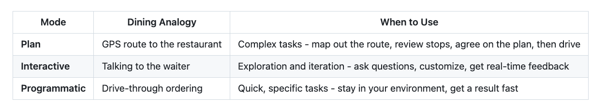
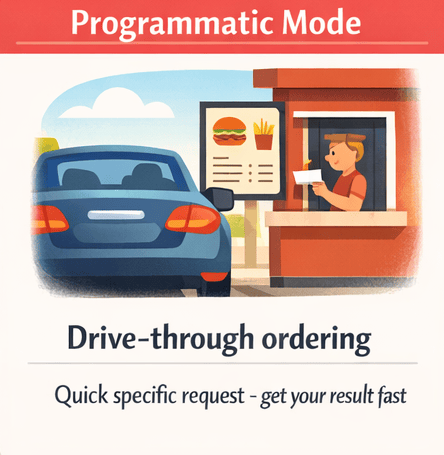

# Chapter 01: First Steps

This chapter is where the magic starts! You'll experience firsthand why developers describe GitHub Copilot CLI as having a senior engineer on speed dial. You'll watch AI find security bugs in seconds, get complex code explained in plain English, and generate working scripts instantly. Then you'll master the three interaction modes (Interactive, Plan, and Programmatic) so you know exactly which one to use for any task.

⚠️ Prerequisites: Make sure you've completed Chapter 00: Quick Start first. You'll need GitHub Copilot CLI installed and authenticated before running the demos below.

🎯 Learning Objectives

By the end of this chapter, you'll be able to:
- Experience the productivity boost GitHub Copilot CLI provides through hands-on demos
- Choose the right mode (Interactive, Plan, or Programmatic) for any task
- Use slash commands to control your sessions

⏱️ Estimated Time: ~45 minutes (15 min reading + 30 min hands-on)

## Your First Copilot CLI Experience


Jump right in and see what Copilot CLI can do.

## Getting Comfortable: Your First Prompts
Before diving into the impressive demos, let's start with some simple prompts you can try right now. No code repository needed! Just open a terminal and start Copilot CLI:

>copilot

Try these beginner-friendly prompts:

> Explain what a dataclass is in Python in simple terms

> Write a function that sorts a list of dictionaries by a specific key

> What's the difference between a list and a tuple in Python?

> Give me 5 best practices for writing clean Python code

Don't use Python? No problem! Just ask questions about your language of choice.

Notice how natural it feels. Just ask questions like you would to a colleague. When you're done exploring, type /exit to leave the session.

The key insight: GitHub Copilot CLI is conversational. You don't need special syntax to get started. Just ask questions in plain English.

## See It In Action
Now let's see why developers are calling this "having a senior engineer on speed dial."

📖 Reading the Examples: Lines starting with > are prompts you type inside an interactive Copilot CLI session. Lines without a > prefix are shell commands you run in your terminal.
💡 About Example Outputs: The sample outputs shown throughout this course are illustrative. Because Copilot CLI's responses vary each time, your results will differ in wording, formatting, and detail. Focus on the type of information returned, not the exact text.

### Demo 1: Code Review in Seconds
The course includes sample files with intentional code quality issues. If you're working on your local machine and haven't already cloned the repo, please run the git clone command below, navigate to the copilot-cli-for-beginners folder, and then run the copilot command.

```bash
# Clone the course repository if you're working locally and haven't already
git clone https://github.com/github/copilot-cli-for-beginners
cd copilot-cli-for-beginners

# Start Copilot
copilot
```

Once inside the interactive Copilot CLI session, run the following:

> Review @samples/book-app-project/book_app.py for code quality issues and suggest improvements

💡 What's the @ symbol used for? The @ symbol tells Copilot CLI to read a file. You'll learn all about this in Chapter 02. For now, just copy the command exactly as shown.

🎬 See it in action!
The takeaway: A professional code review in seconds. Manual review would take...well...more time than that!

### Demo 2: Explain Confusing Code
Ever stared at code wondering what it does? Try this in your Copilot CLI session:

> Explain what @samples/book-app-project/books.py does in simple terms

🎬 See it in action!
What happens: (your output will differ) Copilot CLI reads the file, understands the code, and explains it in plain English.

### Demo 3: Generate Working Code
Need a function you'd otherwise spend 15 minutes googling? Still in your session:

The takeaway: Instant gratification, and you stayed in one continuous session the whole time.

## Modes and Commands


🧩 Real-World Analogy: Dining Out
Think of using GitHub Copilot CLI like going out to eat. From planning the trip to placing your order, different situations call for different approaches:



Just like dining out, you'll naturally learn when each approach feels right.

## Which Mode Should I Start With?

Start with Interactive mode.
* You can experiment and ask follow-up questions
* Context builds naturally through conversation
* Mistakes are easy to correct with /clear

Once you're comfortable, try:

**Programmatic mode** (copilot -p "<your prompt>") for quick, one-off questions
**Plan mode** (/plan) when you need to plan things out in more detail before coding

## The Three Modes

### Mode 1: Interactive Mode (start here)


Best for: Exploration, iteration, multi-turn conversations. Like talking to a waiter who can answer questions, take feedback, and adjust the order on the fly.

Start an interactive session:

> copilot

As you've seen up to this point, you'll see a prompt where you can type naturally. To get help on available commands, just type:

> /help

Key insight: Interactive mode maintains context. Each message builds on previous ones, just like a real conversation.

### Mode 2: Plan Mode


Best for: Complex tasks where you want to review the approach before execution. Similar to planning a route before a trip using GPS.

Plan mode helps you create a step-by-step plan before writing any code. Use the /plan command, press Shift+Tab to cycle into Plan Mode:

```bash
copilot

> /plan Add a "mark as read" command to the book app
```

💡 Tip: Shift+Tab cycles between modes: Interactive → Plan → Autopilot. Press it anytime during an interactive session to switch modes without typing a command.

You can also launch Copilot CLI directly in plan mode using the --plan flag:

copilot --plan

Plan mode output: (your output may differ)

Plan Ready for Review                                                                                                          │
│ ────────────────────────────────────────────────────────────────────────────────────────────────────────────────────────────── │
│ Plan: Add "mark as read" CLI command                                                                                           │
│                                                                                                                                │
│ Problem                                                                                                                        │
│                                                                                                                                │
│  - The Book Collection app supports marking a book as read via BookCollection.mark_as_read, but the CLI (book_app.py) has no   │
│ command to expose this functionality.                                                                                          │
│                                                                                                                                │
│ Goal                                                                                                                           │
│                                                                                                                                │
│  - Add a new CLI command that lets users mark a book as read by title.                                                         │
│                                                                                                                                │
│ Approach                                                                                                                       │
│                                                                                                                                │
│  1. Add a new command handler in book_app.py (handle_mark) that: - Prompts the user for a book title (or accepts it as a CLI   │
│ argument)                                                                                                                      │
│  - Calls collection.mark_as_read(title)                                                                                        │
│  - Prints clear success/failure messages                                                                                       │
│  2. Wire the new command name mark into the main() dispatcher in book_app.py.                                                  │
│  3. Add unit tests for the BookCollection CLI path and the handler behavior.                                                   │
│  4. Update README.md with the new mark command.                                                                                │
│                                                                                                                                │
│ Key files to change                                                                                                            │
│                                                                                                                                │
│  - samples/book-app-project/book_app.py  (add handler and CLI entry)                                                           │
│  - samples/book-app-project/tests/test_books.py (add/extend tests covering CLI handler)                                        │
│  - samples/book-app-project/README.md (document new command)                                                                   │
│                                                                                                                                │
│ Todos                                                                                                                          │
│                                                                                                                                │
│  - implement-mark-command: Adding mark-as-read CLI command                                                                     │
│  Description: Add mark command to book_app.py. Prompt for or accept a title argument, call BookCollection.mark_as_read, and    │
│ print outcome. Ensure errors are handled gracefully.                                                                           │
│  - add-cli-tests: Adding tests for mark command                                                                                │
│  Description: Add tests that verify marking an existing book returns success and that marking a nonexistent title reports      │
│ failure. Use the existing test fixture to keep data isolated.                                                                  │
│  - update-readme: Updating README                                                                                              │
│  Description: Document the new mark command and usage examples.                                                                │
│                                                                                                                                │
│ Notes and decisions                                                                                                            │
│                                                                                                                                │
│  - Marking will be done by title (user chose "By title").                                                                      │
│  - The handler will accept a title argument if provided via CLI (e.g., python book_app.py mark "Dune") and fall back to        │
│ prompting when missing.                                                                                                        │
│  - Persistence uses existing DATA_FILE behavior; exceptions will be handled and surfaced as user-friendly messages.            │
│                                                                                                                                │
│   1. Accept plan and build on default permissions (recommended)                                                                │
│   2. Exit plan mode and I will prompt myself                                                                                   │
│ ❯ 3. Suggest changes     

Key insight: Plan mode lets you review and modify the approach before any code is written. Once a plan is complete, you can even tell Copilot CLI to save it to a file for later reference. For example, "Save this plan to mark_as_read_plan.md" would create a markdown file with the plan details.

💡 Want something more complex? Try: /plan Add search and filter capabilities to the book app. Plan mode scales from simple features to full applications.

📚 Autopilot mode: You may have noticed Shift+Tab cycles through a third mode called Autopilot. In autopilot mode, Copilot works through an entire plan without waiting for your input after each step — like handing a task to a colleague and saying "let me know when you're finished." The typical workflow is plan → accept → autopilot, which means you need to be good at writing plans first. You can also launch directly into autopilot with copilot --autopilot. Get comfortable with Interactive and Plan modes first, then see the official docs when you're ready.

### Mode 3: Programmatic Mode



Best for: Automation, scripts, CI/CD, single-shot commands. Like using a drive-through for a quick order without needing to talk to a waiter.

Use the -p flag for one-time commands that don't need interaction:

```bash
# Generate code
copilot -p "Write a function that checks if a number is even or odd"

# Get quick help
copilot -p "How do I read a JSON file in Python?"
```

📚 Going Further: Using Programmatic Mode in Scripts (click to expand)
Once you're comfortable, you can use -p in shell scripts:

```bash
#!/bin/bash

# Generate commit messages automatically
COMMIT_MSG=$(copilot -p "Generate a commit message for: $(git diff --staged)")
git commit -m "$COMMIT_MSG"

# Review a file
copilot --allow-all -p "Review @myfile.py for issues"
```
⚠️ About --allow-all: This flag skips all permission prompts, letting Copilot CLI read files, run commands, and access URLs without asking first. This is necessary for programmatic mode (-p) since there's no interactive session to approve actions. Only use --allow-all with prompts you've written yourself and in directories you trust. Never use it with untrusted input or in sensitive directories.

## Essential Slash Commands
These commands are great to learn initially as you're getting started with Copilot CLI:

Command	What It Does	When to Use
/ask	Ask a quick question without it affecting your conversation history	When you want a quick answer without derailing your current task
/clear	Clear conversation and start fresh	When switching topics
/help	Show all available commands	When you forget a command
/model	Show or switch AI model	When you want to change the AI model
/plan	Plan your work out before coding	For more complex features
/research	Deep research using GitHub and web sources	When you need to investigate a topic before coding
/exit	End the session	When you're done
💡 /ask vs regular chat: Normally every message you send becomes part of the ongoing conversation and affects future responses. /ask is an "off the record" shortcut — perfect for quick one-off questions like /ask What does YAML mean? without polluting your session context.

💡 Tab-completion: When typing a slash command, press Tab to auto-complete the command name or cycle through available subcommands and arguments. This is especially handy when you can't remember the exact name of a command.

That's it for getting started! As you become comfortable, you can explore additional commands.

📚 Official Documentation: CLI command reference for the complete list of commands and flags.

## Agent Environment
Command	What It Does
/agent	Browse and select from available agents
/env	Show loaded environment details — what instructions, MCP servers, skills, agents, and plugins are active
/init	Initialize Copilot instructions for your repository
/mcp	Manage MCP server configuration
/skills	Manage skills for enhanced capabilities
💡 Agents are covered in Chapter 04, skills are covered in Chapter 05, and MCP servers are covered in Chapter 06.

## Models and Subagents
Command	What It Does
/delegate	Hand off task to GitHub Copilot cloud agent
/fleet	Split a complex task into parallel subtasks for faster completion
| /model	| Show or switch AI model | When you want to change the AI model |
| /tasks	| View background subagents and detached shell sessions |

## Code
Command	What It Does
/diff	Review the changes made in the current directory
/pr	Operate on pull requests for the current branch
/research	Run deep research investigation using GitHub and web sources
/review	Run the code-review agent to analyze changes
| /terminal-setup	| Enable multiline input support (shift+enter and ctrl+enter) |

## Permissions
Command	What It Does
/add-dir <directory>	Add a directory to allowed list
/allow-all [on|off|show]	Auto-approve all permission prompts; use on to enable, off to disable, show to check current status
/yolo	Quick alias for /allow-all on — auto-approves all permission prompts.
/cwd, /cd [directory]	View or change working directory
/list-dirs	Show all allowed directories
⚠️ Use with caution: /allow-all and /yolo skip confirmation prompts. Great for trusted projects, but be careful with untrusted code.

## Session
Command	What It Does
/clear	Abandons the current session (no history saved) and starts a fresh conversation
/compact	Summarize conversation to reduce context usage
/context	Show context window token usage and visualization
/keep-alive	Prevent your system from sleeping while Copilot CLI is active — handy for long-running tasks on a laptop
/new	Ends the current session (saving it to history for search/resume) and starts a fresh conversation.
/resume	Switch to a different session (optionally specify session ID or name)
/rename	Rename the current session (omit the name to auto-generate one)
/rewind	Open a timeline picker to roll back to any earlier point in the conversation
/usage	Display session usage metrics and statistics
/session	Show session info and workspace summary; use /session delete, /session delete <id>, or /session delete-all to remove sessions
| /share	| Export session as a markdown file, GitHub gist, or self-contained HTML file |

## Display
Command	What It Does
/statusline (or /footer)	Customize which items appear in the status bar at the bottom of the session (directory, branch, effort, context window, quota)
| /theme	| View or set terminal theme |

## Help and Feedback
Command	What It Does
/changelog	Display changelog for CLI versions
/feedback	Submit feedback to GitHub
| /help	| Show all available commands |

## Quick Shell Commands

Run shell commands directly without AI by prefixing with !:

```bash
copilot

> !git status
# Runs git status directly, bypassing the AI

> !python -m pytest tests/
# Runs pytest directly
```

## Switching Models
Copilot CLI supports multiple AI models from OpenAI, Anthropic, Google, and others. The models available to you depend on your subscription level and region. Use /model to see your options and switch between them:

```bash
copilot
> /model

# Shows available models and lets you pick one. Select Sonnet 4.5.
```
💡 Tip: Some models cost more "premium requests" than others. Models marked 1x (like Claude Sonnet 4.5) are a great default. They're capable and efficient. Higher-multiplier models use your premium request quota faster, so save those for when you really need them.

💡 Not sure which model to pick? Select Auto from the model picker to let Copilot automatically choose the best available model for each session. This is a great default if you're just getting started and don't want to think about model selection.

## ▶️ Try It Yourself

### Interactive Exploration
Start Copilot and use follow-up prompts to iteratively improve the book app:

```bash
copilot

> Review @samples/book-app-project/book_app.py - what could be improved?

> Refactor the if/elif chain into a more maintainable structure

> Add type hints to all the handler functions

> /exit
```

### Plan a Feature
Use /plan to have Copilot CLI map out an implementation before writing any code:

```bash
copilot

> /plan Add a search feature to the book app that can find books by title or author

# Review the plan
# Approve or modify
# Watch it implement step by step
```

### Automate with Programmatic Mode
The -p flag lets you run Copilot CLI directly from your terminal without entering interactive mode. Copy and paste the following script into your terminal (not inside Copilot) from the repository root to review all Python files in the book app.

```bash
# Review all Python files in the book app
for file in samples/book-app-project/*.py; do
echo "Reviewing $file..."
copilot --allow-all -p "Quick code quality review of @$file - critical issues only"
done
```

### PowerShell (Windows):

```powershell
# Review all Python files in the book app
Get-ChildItem samples/book-app-project/*.py | ForEach-Object {
$relativePath = "samples/book-app-project/$($_.Name)";
Write-Host "Reviewing $relativePath...";
copilot --allow-all -p "Quick code quality review of @$relativePath - critical issues only"
}
```
After completing the demos, try these variations:

- Interactive Challenge: Start copilot and explore the book app. Ask about @samples/book-app-project/books.py and request improvements 3 times in a row.
- Plan Mode Challenge: Run /plan Add rating and review features to the book app. Read the plan carefully. Does it make sense?
- Programmatic Challenge: Run copilot --allow-all -p "List all functions in @samples/book-app-project/book_app.py and describe what each does". Did it work on the first try?

💡 Tip: Control Your CLI Session from Web or Mobile

GitHub Copilot CLI supports remote sessions, letting you monitor and interact with a running CLI session from a web browser (on desktop or mobile) or the GitHub Mobile app without being physically at your terminal.

Start a remote session with the --remote flag:

```bash
copilot --remote
```

Copilot CLI will display a link and provide access to a QR code. Open the link on your phone or in a desktop browser tab to watch the session in real time, send follow-up prompts, review plans, and steer the agent remotely. Sessions are user-specific so you can only access your own Copilot CLI sessions.

You can also enable remote access from inside an active session at any time:

```bash
> /remote
```

Additional details about remote sessions can be found in the Copilot CLI docs.

## Assignment

### Main Challenge: Improve the Book App Utilities
The hands-on examples focused on reviewing and refactoring book_app.py. Now practice the same skills on a different file, utils.py:

- Start an interactive session: copilot
- Ask Copilot CLI to summarize the file: "Summarize @samples/book-app-project/utils.py and explain what each function in this file does"
- Ask it to add input validation: "Add validation to get_user_choice() so it handles empty input and non-numeric entries"
- Ask it to improve error handling: "What happens if get_book_details() receives an empty string for the title? Add guards for that."
- Ask for a docstring: "Add a comprehensive docstring to get_book_details() with parameter descriptions and return values"
- Observe how context carries between prompts. Each improvement builds on the last
- Exit with /exit
Success criteria: You should have an improved utils.py with input validation, error handling, and a docstring, all built through a multi-turn conversation.

💡 Hints (click to expand)

### Bonus Challenge: Compare the Modes
The examples used /plan for a search feature and -p for batch reviews. Now try all three modes on a single new task: adding a list_by_year() method to the BookCollection class:

- Interactive: copilot → ask it to design and build the method step by step
- Plan: /plan Add a list_by_year(start, end) method to BookCollection that filters books by publication year range
- Programmatic: copilot --allow-all -p "@samples/book-app-project/books.py Add a list_by_year(start, end) method that returns books published between start and end year inclusive"
- Reflection: Which mode felt most natural? When would you use each?

## 🔧 Common Mistakes & Troubleshooting

(Add common issues and solutions here)

## Summary

🔑 Key Takeaways
- Interactive mode is for exploration and iteration - context carries forward. It's like having a conversation with someone who remembers what you've said up to that point.
- Plan mode is normally for more involved tasks. Review before implementation.
- Programmatic mode is for automation. No interaction needed.
- Essential commands (/ask, /help, /clear, /plan, /research, /model, /exit) cover most daily use.

📋 Quick Reference: See the GitHub Copilot CLI command reference for a complete list of commands and shortcuts.

## ➡️ What's Next

Now that you understand the three modes, let's learn how to give Copilot CLI context about your code.

In Chapter 02: Context and Conversations, you'll learn:

- The @ syntax for referencing files and directories
- Session management with --resume and --continue
- How context management makes Copilot CLI truly powerful
