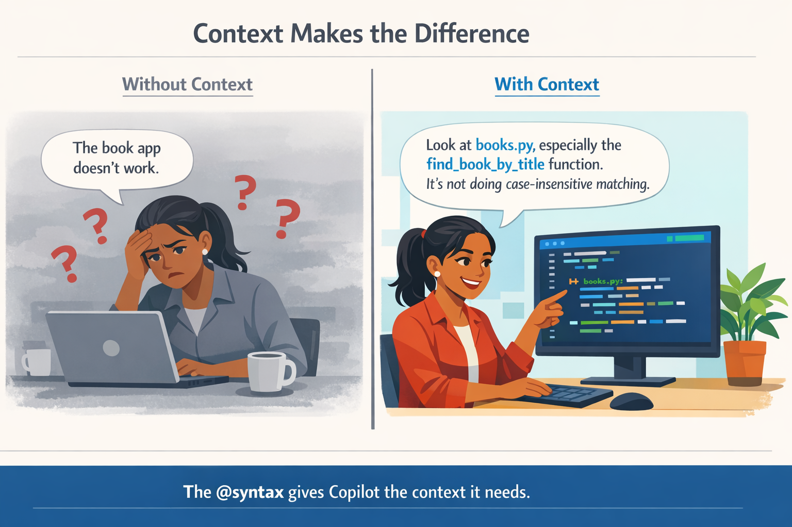
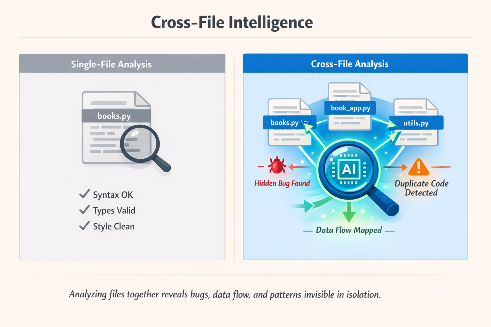
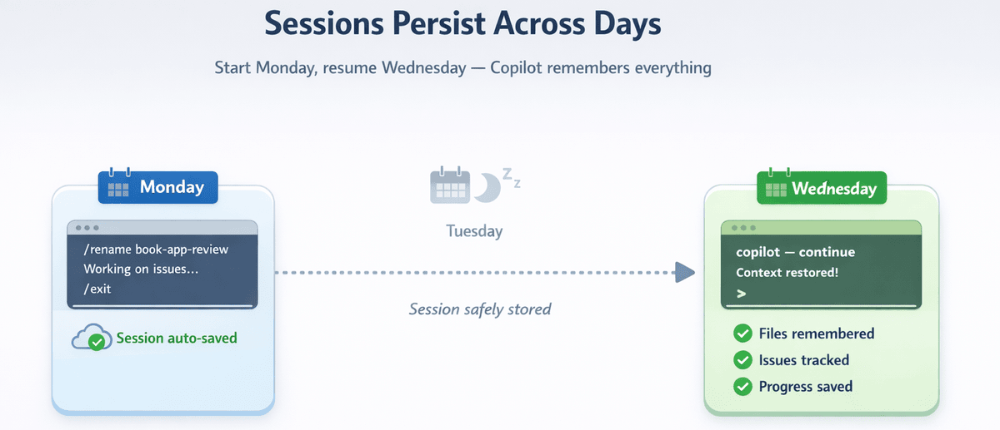

# Chapter 02: Context and Conversations

In this chapter, you'll unlock the real power of GitHub Copilot CLI: context. You'll learn to use the @ syntax to reference files and directories, giving Copilot CLI deep understanding of your codebase. You'll discover how to maintain conversations across sessions, resume work days later exactly where you left off, and see how cross-file analysis catches bugs that single-file reviews miss entirely.

## 🎯 Learning Objectives

By the end of this chapter, you'll be able to:

- Use the @ syntax to reference files, directories, and images
- Resume previous sessions with `--resume` and `--continue`
- Understand how context windows work
- Write effective multi-turn conversations
- Manage directory permissions for multi-project workflows

## 🧩 Real-World Analogy: Working with a Colleague



_Just like your colleagues, Copilot CLI isn't a mind reader. Providing more information helps humans and Copilot alike provide targeted support!_

Imagine explaining a bug to a colleague:

Without context: "The book app doesn't work."

With context: "Look at books.py, especially the find_book_by_title function. It's not doing case-insensitive matching."

To provide context to Copilot CLI use the @ syntax to point Copilot CLI at specific files.

## Essential: Basic Context


This section covers everything you need to work effectively with context. Master these basics first.

## The @ Syntax

The @ symbol references files and directories in your prompts. It's how you tell Copilot CLI "look at this file."

💡 **Note**: All examples in this course use the `samples/` folder included in this repository, so you can try every command directly.

## Try It Now (No Setup Required)

**FYI**: You can try this with any file on your computer:

```bash
copilot
# Point at any file you have
> Explain what @package.json does
> Summarize @README.md
> What's in @.gitignore and why?
```

💡 **Don't have a project handy?** Create a quick test file:

```bash
echo "def greet(name): return 'Hello ' + name" > test.py
copilot
> What does @test.py do?
```

## Basic @ Patterns

| Pattern | What It Does | Example Use |
|---------|-------------|-------------|
| `@file.py` | Reference a single file | `Review @samples/book-app-project/books.py` |
| `@folder/` | Reference all files in a directory | `Review @samples/book-app-project/` |
| `@file1.py @file2.py` | Reference multiple files | `Compare @samples/book-app-project/book_app.py @samples/book-app-project/books.py` |

### Reference a Single File

```bash
copilot
> Explain what @samples/book-app-project/utils.py does
```

### Reference Multiple Files

```bash
copilot
> Compare @samples/book-app-project/book_app.py and @samples/book-app-project/books.py for consistency
```

### Reference an Entire Directory

```bash
copilot
> Review all files in @samples/book-app-project/ for error handling
```

## Cross-File Intelligence

This is where context becomes a superpower. Single-file analysis is useful. Cross-file analysis is transformative.



### Demo: Find Bugs That Span Multiple Files

```bash
copilot
> @samples/book-app-project/book_app.py @samples/book-app-project/books.py
> How do these files work together? What's the data flow?
```

💡 **Advanced Option**: For security-focused cross-file analysis, try the Python security examples:

```bash
> @samples/buggy-code/python/user_service.py @samples/buggy-code/python/payment_processor.py
> Find security vulnerabilities that span BOTH files
```

Why this matters: A single-file review would miss the bigger picture. Only cross-file analysis reveals:

- Duplicate code that should be consolidated
- Data flow patterns showing how components interact
- Architectural issues that affect maintainability


### New to a project? Learn about it quickly using Copilot CLI

```bash
copilot
> @samples/book-app-project/
> In one paragraph, what does this app do and what are its biggest quality issues?
```

## Practical Examples

### Example 1: Code Review with Context

```bash
copilot
> @samples/book-app-project/books.py Review this file for potential bugs
```

Your feedback will be different. Copilot CLI now has the full file content and can give specific feedback:

```bash
> What about @samples/book-app-project/book_app.py?
```

Your feedback will be different. Now reviewing `book_app.py`, but still aware of `books.py` context.

### Example 2: Understanding a Codebase

```bash
copilot
> @samples/book-app-project/books.py What does this module do?
```

Copilot CLI reads `books.py` and understands the `BookCollection` class.

```bash
> @samples/book-app-project/ Give me an overview of the code structure
```

Copilot CLI scans the directory and summarizes.

```bash
> How does the app save and load books?
```

Copilot CLI can trace through the code it's already seen.

### Example 3: Multi-File Refactoring

```bash
copilot
> @samples/book-app-project/book_app.py @samples/book-app-project/utils.py
> I see duplicate display functions: show_books() and print_books(). Help me consolidate these.
```

Copilot CLI sees both files and can suggest how to merge the duplicate code.

## Session Management

Sessions are automatically saved as you work. You can resume previous sessions to continue where you left off.

### Sessions Auto-Save

Every conversation is automatically saved. Just exit normally:

```bash
copilot
> @samples/book-app-project/ Let's improve error handling across all modules

[... do some work ...]

> /exit
```

### Resume the Most Recent Session

```bash
# Continue where you left off
copilot --continue
```

### Resume a Specific Session

```bash
# Pick from a list of sessions interactively
copilot --resume

# Or resume a specific session by ID
copilot --resume=abc123

# Or resume by the name you gave the session
copilot --resume="my book app review"
```

💡 **How do I find a session ID?** You don't need to memorize them. Running `copilot --resume` without an ID shows an interactive list of your previous sessions, their names, IDs, and when they were last active. Just pick the one you want.

**What about multiple terminals?** Each terminal window is its own session with its own context. If you have Copilot CLI open in three terminals, that's three separate sessions. Running `--resume` from any terminal lets you browse all of them. The `--continue` flag grabs the session from the current working directory first; if none exists there, it picks the most recently active session.

**Can I switch sessions without restarting?** Yes. Use the `/resume` slash command from inside an active session:

```bash
> /resume
# Shows a list of sessions to switch to
```

### Organize Your Sessions

Give sessions meaningful names so you can find them later. You can name a session when you start it, or rename it at any time while inside the session:

```bash
# Name a session right when you start it
copilot --name book-app-review

# Or rename the current session from inside
copilot
> /rename book-app-review
# Session renamed for easier identification
```

Once a session is named, you can resume it directly by name without browsing through a list:

```bash
copilot --resume=book-app-review
```

To clean up sessions you no longer need, use `/session delete` from inside a session:

```bash
copilot
> /session delete            # Deletes the current session
> /session delete abc123     # Deletes a specific session by ID
> /session delete-all        # Deletes all sessions (use with care!)
```

## Persistent Memory Across Sessions

Sessions save your conversation history, but memory goes one step further and lets Copilot CLI remember preferences and facts across all sessions, not just within a single one.

```bash
copilot
> /memory show
# Shows what Copilot CLI currently remembers about you and your project

> /memory on
# Enables memory (on by default if your account supports it)

> /memory off
# Disables memory (useful if you prefer a fresh slate each time)
```

For example, if you tell Copilot CLI "I always prefer pytest for Python testing", it can remember that preference and apply it automatically in future sessions. All without you having to repeat it.

💡 **Memory vs. Sessions**: Sessions save conversation history so you can resume a specific task. Memory saves reusable repository facts and user preferences that Copilot can apply in future work. Think of sessions as task notebooks, and memory as reusable context Copilot can carry forward.

## Check and Manage Context

As you add files and conversation, Copilot CLI's context window fills up. Several commands are available to help you stay in control:

```bash
copilot
> /context
Context usage: 62k/200k tokens (31%)

> /clear
# Abandons the current session (no history saved) and starts a fresh conversation

> /new
# Ends the current session (saving it to history for search/resume) and starts a fresh conversation

> /rewind
# Opens a timeline picker allowing you to roll back to an earlier point in your conversation
```

💡 **When to use `/clear` or `/new`**: If you've been reviewing `books.py` and want to switch to discussing `utils.py`, run `/new` first (or `/clear` if you don't need the session history). Otherwise stale context from the old topic may confuse responses.

💡 **Made a mistake or want to try a different approach?** Use `/rewind` (or press Esc twice) to open a timeline picker that lets you roll back to any earlier point in your conversation, not just the most recent one. This is useful when you went down the wrong path and want to backtrack without starting over entirely.

## Pick Up Where You Left Off



Sessions auto-save when you exit. Resume days later with full context: files, issues, and progress all remembered.

Imagine this workflow across multiple days:

```bash
# Monday: Start book app review with a name right from the beginning
copilot --name book-app-review

> @samples/book-app-project/books.py
> Review and number all code quality issues
```

Quality Issues Found:
1. Duplicate display functions (`book_app.py` & `utils.py`) - MEDIUM
2. No input validation for empty strings - MEDIUM
3. Year can be 0 or negative - LOW
4. No type hints on all functions - LOW
5. Missing error logging - LOW

```bash
> Fix issue #1 (duplicate functions)
# Work on the fix...
> /exit

# Wednesday: Resume exactly where you left off, by name
copilot --resume=book-app-review

> What issues remain unfixed from our book app review?
```

Remaining issues from our `book-app-review` session:
- No input validation for empty strings - MEDIUM
- Year can be 0 or negative - LOW
- No type hints on all functions - LOW
- Missing error logging - LOW

Issue #1 (duplicate functions) was fixed on Monday.

```bash
> Let's tackle issue #2 next
```

What makes this powerful: Days later, Copilot CLI remembers:

- The exact file you were working on
- The numbered list of issues
- Which ones you've already addressed
- The context of your conversation

No re-explaining. No re-reading files. Just continue working.

🎉 You now know the essentials! The `@` syntax, session management (`--name`, `--continue`, `--resume`, `/rename`), and context commands (`/context`, `/clear`) are enough to be highly productive. Everything below is optional.

## Optional: Going Deeper


These topics build on the essentials above. Pick what interests you, or skip ahead to practice.

| I want to learn about... | Jump to |
|---|---|
| Wildcard patterns and advanced session commands | Additional @ Patterns & Session Commands |
| Building on context across multiple prompts | Context-Aware Conversations |
| Token limits and `/compact` | Understanding Context Windows |
| How to pick the right files to reference | Choosing What to Reference |
| Analyzing screenshots and mockups | Working with Images |

### Additional @ Patterns & Session Commands

#### Additional @ Patterns

For power users, Copilot CLI supports wildcard patterns and image references:

| Pattern | What It Does |
|---|---|
| `@folder/*.py` | All `.py` files in folder |
| `@**/test_*.py` | Recursive wildcard: find all test files anywhere |
| `@image.png` | Image file for UI review |

```bash
copilot
> Find all TODO comments in @samples/book-app-project/**/*.py
```

#### View Session Info

```bash
copilot
> /session
# Shows current session details and workspace summary

> /usage
# Shows session metrics and statistics
```

#### Share Your Session

```bash
copilot
> /share file ./my-session.md
# Exports session as a markdown file

> /share gist
# Creates a GitHub gist with the session

> /share html
# Exports session as a self-contained interactive HTML file
```

### Context-Aware Conversations

The magic happens when you have multi-turn conversations that build on each other.

#### Example: Progressive Enhancement

```bash
copilot
> @samples/book-app-project/books.py Review the BookCollection class
```

Copilot CLI: "The class looks functional, but I notice:
1. Missing type hints on some methods
2. No validation for empty title/author
3. Could benefit from better error handling"

```bash
> Add type hints to all methods
> Now improve error handling
> Generate tests for this final version
```

### Understanding Context Windows

You already know `/context` and `/clear` from the essentials. Here is the deeper picture of how context windows work.

Every AI has a context window, which is the amount of text it can consider at once.

#### Context Window Visualization

The context window is like a desk: it can only hold so much at once. Files, conversation history, and system prompts all take space.

#### What Happens at the Limit

```bash
copilot
> /context
Context usage: 45,000 / 128,000 tokens (35%)

# As you add more files and conversation, this grows
> @large-codebase/
Context usage: 120,000 / 128,000 tokens (94%)

# Warning: Approaching context limit
> @another-large-file.py
Context limit reached. Older context will be summarized.
```

#### The `/compact` Command

When your context is getting full but you do not want to lose the conversation, `/compact` summarizes your history to free up tokens:

```bash
copilot
> /compact
# Summarizes conversation history, freeing up context space
```

You can also give `/compact` focus instructions to shape what gets prioritized:

```bash
copilot
> /compact focus on the list of bugs we found and decisions made
```

💡 When to use focus instructions: If your conversation covered many topics, focus instructions help `/compact` retain the parts most relevant to your next steps.

#### Context Efficiency Tips

| Situation | Action | Why |
|---|---|---|
| Starting new topic | `/clear` | Removes irrelevant context |
| Went down wrong path | `/rewind` | Roll back to any earlier point |
| Long conversation | `/compact` | Summarizes history, frees tokens |
| Need specific file | `@file.py` not `@folder/` | Loads only what you need |
| Hitting limits | `/new` or `/clear` | Fresh context |
| Multiple topics | Use `/rename` per topic | Easy to resume right session |

#### Best Practices for Large Codebases

- Be specific: `@samples/book-app-project/books.py` instead of `@samples/book-app-project/`
- Clear context between topics: use `/new` or `/clear` when switching focus
- Use `/compact`: summarize conversation to free up context
- Use multiple sessions: one session per feature or topic

### Choosing What to Reference

Not all files are equal when it comes to context. Here is how to choose wisely.

#### File Size Considerations

| File Size | Approximate Tokens | Strategy |
|---|---|---|
| Small (<100 lines) | ~500-1,500 tokens | Reference freely |
| Medium (100-500 lines) | ~1,500-7,500 tokens | Reference specific files |
| Large (500+ lines) | 7,500+ tokens | Be selective, use specific files |
| Very Large (1000+ lines) | 15,000+ tokens | Consider splitting or targeting sections |

Concrete examples:

- The book app's 4 Python files combined ~= 2,000-3,000 tokens
- A typical Python module (200 lines) ~= 3,000 tokens
- A Flask API file (400 lines) ~= 6,000 tokens
- Your `package.json` ~= 200-500 tokens
- A short prompt + response ~= 500-1,500 tokens

💡 Quick estimate for code: multiply lines of code by ~15 to get approximate tokens.

#### What to Include vs. Exclude

High value (include these):

- Entry points (`book_app.py`, `main.py`, `app.py`)
- The specific files you are asking about
- Files directly imported by your target file
- Configuration files (`requirements.txt`, `pyproject.toml`)
- Data models or dataclasses

Lower value (consider excluding):

- Generated files (compiled output, bundled assets)
- Node modules or vendor directories
- Large data files or fixtures
- Files unrelated to your question

#### Practical Example: Staged Context Loading

```bash
copilot
# Step 1: Start with structure
> @package.json What frameworks does this project use?

# Step 2: Narrow based on answer
> @samples/book-app-project/ Show me the project structure

# Step 3: Focus on what matters
> @samples/book-app-project/books.py Review the BookCollection class

# Step 4: Add related files only as needed
> @samples/book-app-project/book_app.py @samples/book-app-project/books.py How does the CLI use the BookCollection?
```

This staged approach keeps context focused and efficient.

### Working with Images

You can include images in your conversations using the `@` syntax, or simply paste from your clipboard (Cmd+V / Ctrl+V). Copilot CLI can analyze screenshots, mockups, and diagrams to help with UI debugging, design implementation, and error analysis.

```bash
copilot
> @images/screenshot.png What is happening in this image?

> @images/mockup.png Write the HTML and CSS to match this design. Place it in a new file called index.html and put the CSS in styles.css.
```

📖 Learn more: See Additional Context Features for supported formats, practical use cases, and tips for combining images with code.

## ▶️ Try It Yourself

### Full Project Review

The course includes sample files you can review directly. Start Copilot and run the prompt shown next:

```bash
copilot
> @samples/book-app-project/ Give me a code quality review of this project
```

Copilot CLI will identify issues like duplicate display functions, missing input validation, and inconsistent error handling.

💡 Want to try with your own files? Create a small Python project (`mkdir -p my-project/src`), add some `.py` files, then use `@my-project/src/` to review them.

### Session Workflow

```bash
copilot
> /rename book-app-review
> @samples/book-app-project/books.py Let's add input validation for empty titles
> Implement that fix
> Now consolidate the duplicate display functions in @samples/book-app-project/
> /exit

# Later - resume where you left off
copilot --continue
> Generate tests for the changes we made
```

After completing the demos, try these variations:

- Cross-file challenge: analyze how `book_app.py` and `books.py` work together.
- Session challenge: start, rename, exit, then resume with `--continue`.
- Context challenge: run `/context`, then `/compact`, and compare token usage.
- Self-check: explain why `@folder/` is more powerful than opening each file individually.

## Assignment

### Main Challenge: Trace the Data Flow

The hands-on examples focused on code quality and validation. Now practice the same context skills on tracing how data moves through the app.

1. Start an interactive session with `copilot`.
2. Reference `books.py` and `book_app.py` together and trace how a book goes from user input to `data.json`.
3. Bring in `data.json` and ask what fails if the file is missing or corrupted.
4. Ask for a cross-file improvement strategy between `books.py` and `utils.py`.
5. Rename the session with `/rename data-flow-analysis`.
6. Exit with `/exit`, then resume with `copilot --continue` and ask a follow-up.

Success criteria: You can trace data across multiple files, resume a named session, and get cross-file suggestions.

### 💡 Hints

Getting started:

```bash
cd /path/to/copilot-cli-for-beginners
copilot
> @samples/book-app-project/books.py @samples/book-app-project/book_app.py Trace how a book goes from user input to being saved in data.json.
> @samples/book-app-project/data.json What happens if this file is missing or corrupted?
> /rename data-flow-analysis
> /exit
```

Then resume with:

```bash
copilot --continue
```

Useful commands:

- `@file.py` - Reference a single file
- `@folder/` - Reference all files in a folder (note the trailing `/`)
- `/context` - Check how much context you are using
- `/rename <name>` - Name your session for easy resuming

### 🔧 Common Mistakes & Troubleshooting

#### Common Mistakes

| Mistake | What Happens | Fix |
|---|---|---|
| Forgetting `@` before filenames | Copilot CLI treats `books.py` as plain text | Use `@samples/book-app-project/books.py` |
| Expecting sessions to persist automatically | Starting fresh loses previous context | Use `--continue` or `--resume` |
| Referencing files outside current directory | Permission denied or file not found | Use `/add-dir /path/to/directory` |
| Not using `/clear` when switching topics | Old context confuses responses | Run `/clear` before the new task |

#### Troubleshooting

"File not found" errors - make sure you are in the correct directory:

```bash
pwd
ls
copilot
> Review @samples/book-app-project/books.py
```

"Permission denied" - add the directory to your allowed list:

```bash
copilot --add-dir /path/to/directory
# Or in a session:
> /add-dir /path/to/directory
```

Context fills up too quickly:

- Be more specific with file references
- Use `/clear` between different topics
- Split work across multiple sessions

## Summary

### 🔑 Key Takeaways

- `@` syntax gives Copilot CLI context about files, directories, and images
- Multi-turn conversations build on each other as context accumulates
- Sessions auto-save: use `--name`, `--resume=<name>`, or `--continue`
- Manage context limits with `/clear`, `/compact`, `/context`, `/new`, and `/rewind`
- Persistent memory (`/memory`) stores reusable preferences across sessions
- Permission flags (`--add-dir`, `--allow-all`) control multi-directory access
- Image references (for example `@screenshot.png`) help debug UI issues visually

📚 Official Documentation: Use Copilot CLI for the complete reference on context, sessions, and working with files.

📋 Quick Reference: See the GitHub Copilot CLI command reference for a complete list of commands and shortcuts.

## What's Next

Now that you can give Copilot CLI context, put it to work on real development tasks. The techniques you just learned are the foundation for the workflows in the next chapter.

In Chapter 03: Development Workflows, you'll learn:

- Code review workflows
- Refactoring patterns
- Debugging assistance
- Test generation
- Git integration
