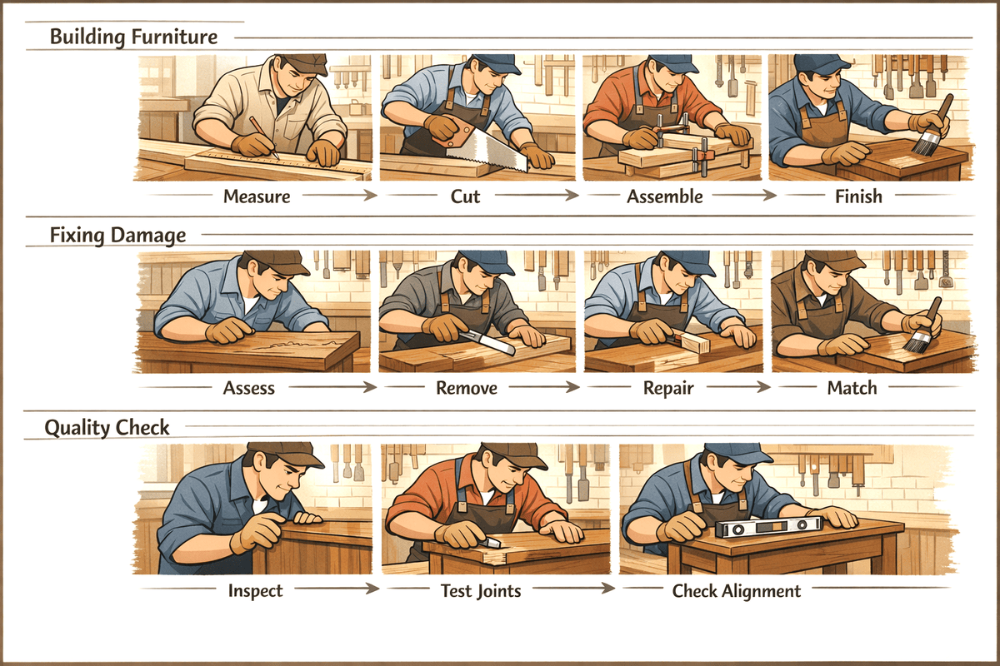
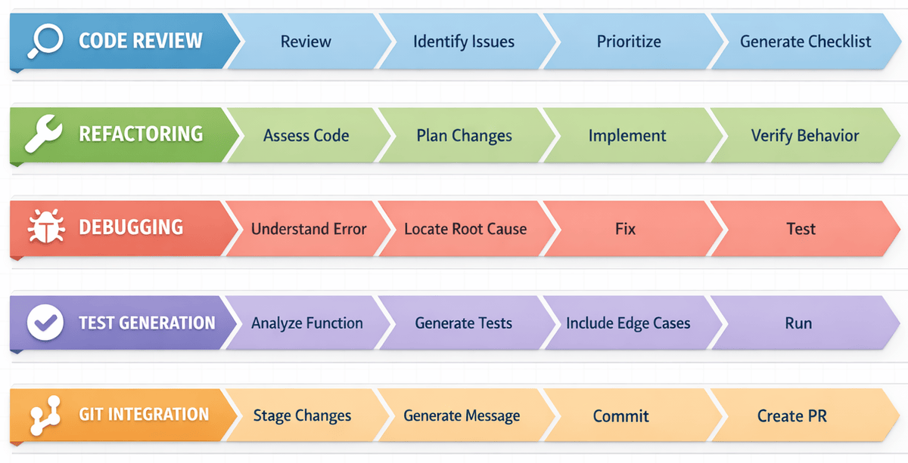

In this Chapter, GitHub Copilot  CLI becomes your daily driver. You'll use it inside the workdflows realy on every day: tsting, refactoring, debugging and  Git

🎯 Learning Objectives
Bei the end of this chapter you'll be able to:
 - Run comprehensive  code reviews with Copilot CLI
 - Refactoring legacy code safly
 - Debugging issue with AI assistance
 - Generate tests automaticly
 - Integrate Coppilot Cli with your git workflow

⏱️ Estimated Time: ~60 minutes (15 min reading + 45 min hands-on)

🧩 Real-World Analogy: A Carpenter's Workflow
A carpartner does't hust konw how to use tools, the have a workflows for different jobs:

Similary , developers have workflows for different tasks. GitHub Copilot CLI enhance eche ot these worlflows, making you more efficent and effective 
in your daily coding taks

The Five Workflows

Each workflow below is self-contained. Pick the ones that match your current needs, or work through them all.

Choose Your Own Adventure
This chapter covers five workflows that developers typically use. However, you don't need to read them all at once! Each workflow is self-contained in a collapsible section below. Pick the ones that match what you need and that fits best with your current project. You can always come back and explore the others later.

| I want to... | Jump to |
|--------------|---------|
| Review code before merging | Workflow 1: Code Review |
| Clean up messy or legacy code | Workflow 2: Refactoring |
| Track down and fix a bug | Workflow 3: Debugging |
| Generate tests for my code | Workflow 4: Test Generation |
| Write better commits and PRs | Workflow 5: Git Integration |
| Research before coding | Quick Tip: Research Before You Plan or Code |
| See a full bug-fix workflow end to end | Putting It All Together |

Select a workflow below to expand it and see how GitHub Copilot CLI can enhance your development process in that area.

Workflow 1: Code Review - Review files, use the /review agent, create severity checklists

Basic Review
This example uses the @ symbol to reference a file, giving Copilot CLI direct access to its contents for review.

copilot
> Review @samples/book-app-project/book_app.py for code quality

Input Validation Review  
Ask Copilot CLI to focus its review on a specific concern (here, input validation) by listing the categories you care about in the prompt.

copilot
> Review @samples/book-app-project/utils.py for input validation issues. Check for: missing validation, error handling gaps, and edge cases

Cross-File Project Review
Reference an entire directory with @ to let Copilot CLI scan every file in the project at once.

copilot

> @samples/book-app-project/ Review this entire project. Create a markdown checklist of issues found, categorized by severity

Interactive Code Review
Use a multi-turn conversation to drill deeper. Start with a broad review, then ask follow-up questions without restarting.

copilot

> @samples/book-app-project/book_app.py Review this file for:
> - Input validation
> - Error handling
> - Code style and best practices

# Copilot CLI provides detailed review

> The user input handling - are there any edge cases I'm missing?

# Copilot CLI shows potential issues with empty strings, special characters

> Create a checklist of all issues found, prioritized by severity

# Copilot CLI generates prioritized action items

Review Checklist Template
Ask Copilot CLI to structure its output in a specific format (here, a severity-categorized markdown checklist you can paste into an issue).

copilot

> Review @samples/book-app-project/ and create a markdown checklist of issues found, categorized by:
> - Critical (data loss risks, crashes)
> - High (bugs, incorrect behavior)
> - Medium (performance, maintainability)
> - Low (style, minor improvements)

Understanding Git Changes (Important for /review)
Before using the /review command, you need to understand two types of changes in git:

| Change Type | What It Means | How to See |
|-------------|---------------|------------|
| Staged changes | Files you've marked for the next commit with `git add` | `git diff --staged` |
| Unstaged changes | Files you've modified but haven't added yet | `git diff` |

# Quick reference
git status           # Shows both staged and unstaged
git add file.py      # Stage a file for commit
git diff             # Shows unstaged changes
git diff --staged    # Shows staged changes

Using the /review Command
The /review command invokes the built-in code-review agent, which is optimized for analyzing staged and unstaged changes with high signal-to-noise output. Use a slash command to trigger a specialized built-in agent instead of writing a free-form prompt.

copilot

> /review
# Invokes the code-review agent on staged/unstaged changes
# Provides focused, actionable feedback

> /review Check for security issues in authentication
# Run review with specific focus area

💡 Tip: The code-review agent works best when you have pending changes. Stage your files with git add for more focused reviews.

Workflow 2: Refactoring - Restructure code, separate concerns, improve error handling

Simple Refactoring
Try this first: @samples/book-app-project/book_app.py The command handling uses if/elif chains. Refactor it to use a dictionary dispatch pattern.

Start with straightforward improvements. Try these on the book app. Each prompt uses an @ file reference paired with a specific refactoring instruction so Copilot CLI knows exactly what to change.

copilot

> @samples/book-app-project/book_app.py The command handling uses if/elif chains. Refactor it to use a dictionary dispatch pattern.

> @samples/book-app-project/utils.py Add type hints to all functions

> @samples/book-app-project/book_app.py Extract the book display logic into utils.py for better separation of concerns

Separate Concerns
Reference multiple files with @ in a single prompt so Copilot CLI can move code between them as part of the refactor.

copilot

> @samples/book-app-project/utils.py @samples/book-app-project/book_app.py
> The utils.py file has print statements mixed with logic. Refactor to separate display functions from data processing.

Improve Error Handling
Provide two related files and describe the cross-cutting concern so Copilot CLI can suggest a consistent fix across both.

copilot
> @samples/book-app-project/utils.py @samples/book-app-project/books.py
> These files have inconsistent error handling. Suggest a unified approach using custom exceptions.

Add Documentation
Use a detailed bullet list to specify exactly what each docstring should contain.

copilot

> @samples/book-app-project/books.py Add comprehensive docstrings to all methods:
> - Include parameter types and descriptions
> - Document return values
> - Note any exceptions raised
> - Add usage examples

Safe Refactoring with Tests
Chain two related requests in a multi-turn conversation. First generate tests, then refactor with those tests as a safety net.

copilot

> @samples/book-app-project/books.py Before refactoring, generate tests for current behavior

# Get tests first

> Now refactor the BookCollection class to use a context manager for file operations

# Refactor with confidence - tests verify behavior is preserved